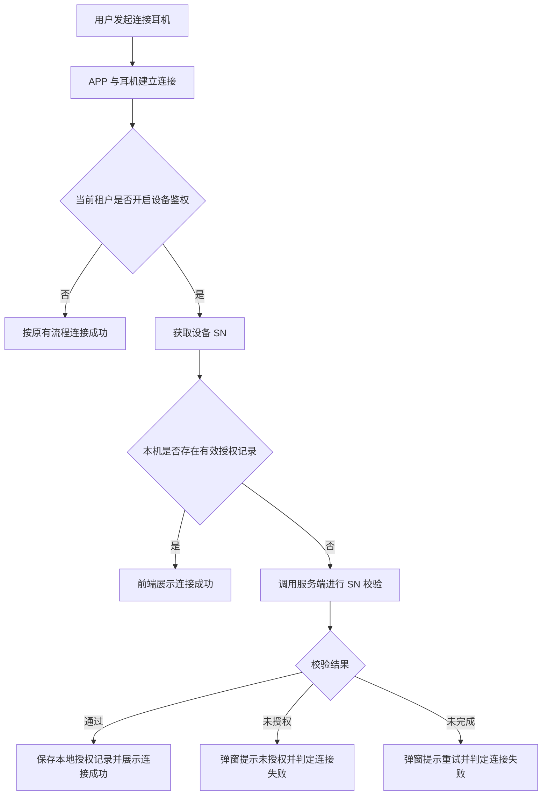
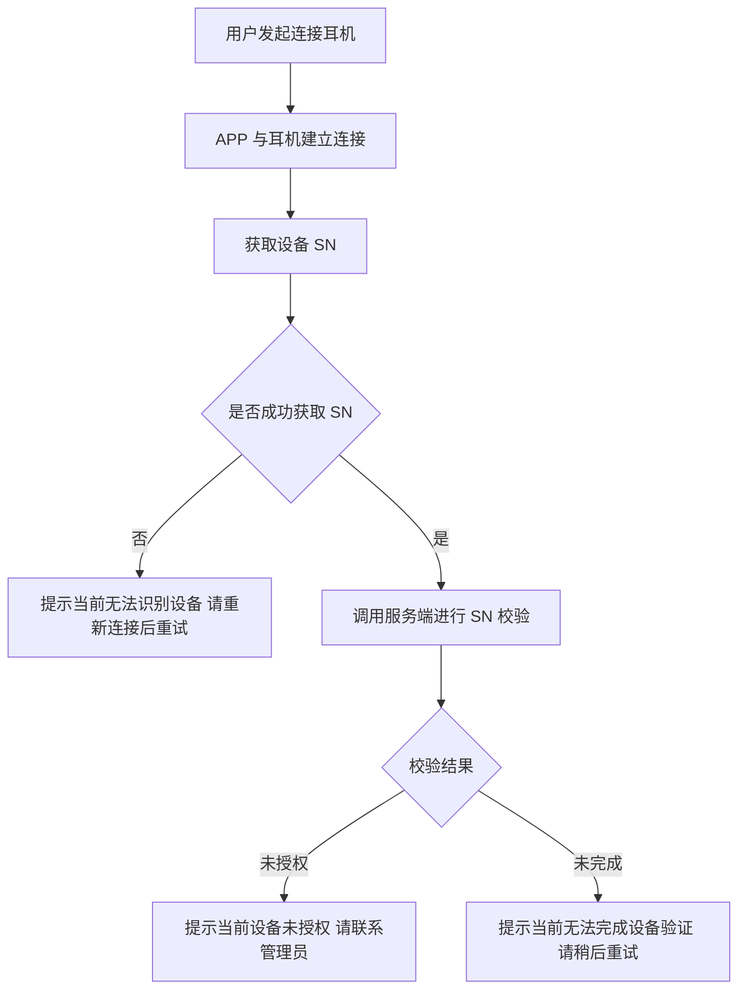
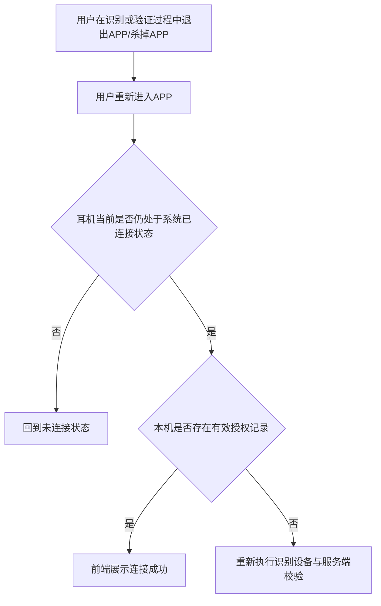

# 设备鉴权一期 PRD

## 1. 需求背景
当前耳机连接 APP 时，缺少设备鉴权能力，存在非授权设备也可接入使用的风险。

本期目标是先跑通设备鉴权链路，并通过租户级开关控制测试范围，避免影响现网其他租户。

## 2. 需求目标
1. 仅允许我方授权设备连接成功并在 APP 内使用
2. 非授权设备不可连接成功
3. 尽量减少对正常连接体验的影响
4. 通过租户级开关控制测试范围和上线风险

## 3. 适用范围
- 每个客户对应一个租户
- 本期支持按租户配置是否启用设备鉴权能力
- 已开启鉴权的租户执行设备校验规则，未开启的租户保持原有连接流程
- 本期租户只用于控制是否启用设备鉴权，不用于区分设备归属

## 4. 核心规则
### 4.1 校验对象
- 设备唯一身份：SN
- SN 由供应商 SDK 自动获取
- 本期只校验该 SN 是否属于我方合法设备池

### 4.2 校验时机
采用“连接后取 SN、连接成功前校验”的方式：
1. APP 先与耳机建立连接，用于获取设备 SN
2. APP 通过供应商 SDK 获取设备 SN
3. APP 调用服务端进行 SN 校验
4. 校验通过后，前端展示连接成功，设备进入可用状态
5. 校验不通过或校验未完成时，本次连接失败

### 4.3 校验结果
本期采用静默鉴权。

- 校验通过：静默通过，不新增提示
- 校验明确不通过：说明设备不在合法设备池内，提示“当前设备未授权，请联系管理员”
- 校验未完成：本次无法得到有效校验结果，不允许连接成功
  - 无法获取设备 SN：提示“当前无法识别设备，请重新连接后重试”
  - 服务端校验未完成：包括无网络、服务异常、请求超时、未返回有效结果，提示“当前无法完成设备验证，请稍后重试”

### 4.4 本地缓存
本期不要求每次连接都重新校验。

- 同一设备在当前手机上成功校验一次后，会记录本地授权结果
- 在缓存有效期内，该设备再次连接当前手机时可直接放行，不重复发起云端校验
- 本期缓存维度为“本机 + 设备 SN”
- 本期缓存有效期暂定为 30 天，用于平衡连接体验与设备管控，后续可根据测试结果调整
- 缓存过期、换机、重装、清数据后，需重新联网校验
- 缓存有效期内按本地授权结果放行，不做实时撤权

### 4.5 中断与重试
- 本期不保留进行中的鉴权过程
- 用户在识别或验证过程中退出 APP、杀掉 APP 或 APP 被系统回收后，重新进入时，不恢复上次未完成的中间状态
- 若设备仍处于系统已连接状态，则重新判断是否有本机有效缓存；有缓存则直接放行，无缓存则重新执行识别和校验
- 本期不做自动重试
- 获取 SN 失败或服务端校验未完成时，本次连接失败；用户需重新发起连接，才会再次触发识别和校验

## 5. 关键流程
### 5.1 已开启鉴权租户：首次连接

### 5.2 已开启鉴权租户：首次连接失败

### 5.3 已开启鉴权租户：中断后重新进入

## 6. 交互设计说明
### 6.1 交互原则
- 本期采用静默鉴权，校验通过时不新增提示
- 仅在校验失败时通过弹窗提示用户
- 设备鉴权失败的弹窗，在当前页面首次识别到失败结果时弹出
- 同一次识别结果只弹一次；用户关闭弹窗后，本次结果不重复弹出，重新触发连接或出现新的识别结果后才再次弹出

### 6.2 从 APP 内发起连接
1. 用户在首页看到耳机未连接状态，点击进入设备连接页
2. 用户在设备连接页点击“去设置”，跳转系统蓝牙设置页
3. 用户在系统蓝牙完成连接后，返回 APP 的设备连接页
4. APP 在设备连接页完成设备识别和鉴权
5. 校验通过时，当前页直接展示连接成功结果，如显示设备电量
6. 校验失败时，在当前设备连接页弹窗提示

### 6.3 先在系统蓝牙连接，再打开 APP
1. 用户未先打开 APP，而是直接在系统蓝牙中连接耳机
2. 用户打开 APP 进入首页
3. APP 在首页首次识别到设备已连接状态，并完成设备鉴权
4. 校验通过时，首页直接展示已连接结果
5. 校验失败时，在首页弹窗提示

### 6.4 失败弹窗
- 未授权设备：提示“当前设备未授权，请联系管理员”
- 无法获取设备 SN：提示“当前无法识别设备，请重新连接后重试”
- 服务端校验未完成：提示“当前无法完成设备验证，请稍后重试”
- 失败弹窗仅保留一个操作按钮：我知道了
- 用户点击“我知道了”后关闭弹窗

### 6.5 弹窗关闭后的反馈
- 用户点击“我知道了”后关闭弹窗
- 弹窗关闭后，本次连接失败
- 页面停留在当前识别到失败结果的页面
- 本期不自动重试
- 用户需重新发起连接，才会再次触发识别和鉴权

## 7. 边界场景
- 无法获取 SN：不放行，提示“当前无法识别设备，请重新连接后重试”
- 服务端校验未完成：包括无网络、服务异常、请求超时、未返回有效结果，不放行并提示“当前无法完成设备验证，请稍后重试”
- 已授权设备离线连接：本机缓存有效则允许继续使用；无缓存则不允许离线首次放行
- 未开启鉴权的租户：保持原有连接逻辑
- 切换租户后连接同一设备：若新租户开启鉴权，仍按“是否属于我方合法设备池”执行校验
- 设备在缓存有效期内被移出合法设备池：缓存有效期内仍按本地授权结果放行，缓存失效后重新联网校验
- 鉴权过程中退出 APP 或杀掉 APP：不保留中间状态，重新进入后按当前连接状态重新判断
- 获取 SN 失败或服务端校验未完成后：本期不自动重试，需由用户重新发起连接
