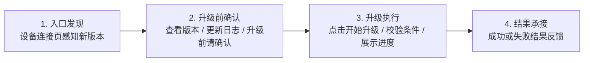
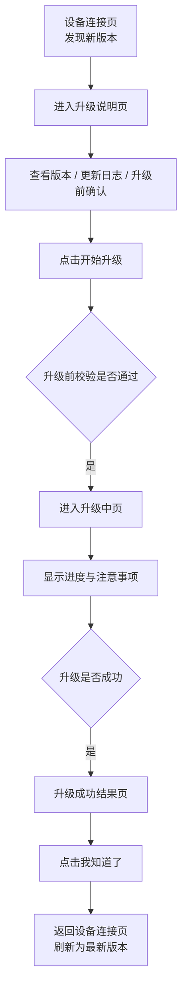
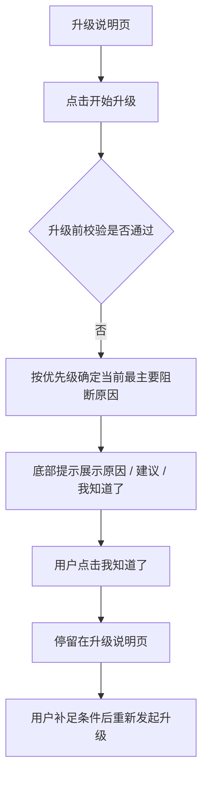
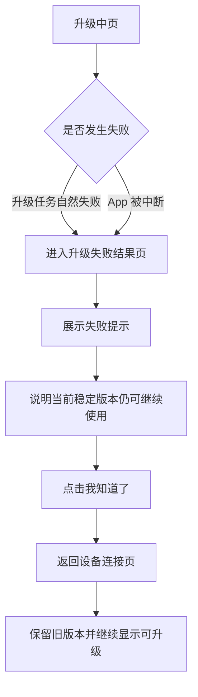

# F1 / F2 硬件云端 OTA 手动升级能力 PRD

## 1. 需求背景
为支持 F1 / F2 硬件在交付后的问题修复与能力迭代，需要提供耳机固件的云端 OTA 升级能力。

本期聚焦手动升级，目标是在尽量不打扰录音主链路的前提下，让用户能够在设备连接页完成一次安全、可理解、失败可恢复的固件升级。

## 2. 需求目标
1. 支持 F1 / F2 耳机通过 App 完成手动固件升级。
2. 面向全量租户提供统一升级能力，不做租户差异化规则。
3. 在保证升级安全的前提下，尽量减少对录音主流程的打扰。
4. 升级失败后不影响当前稳定版本继续使用。

## 3. 适用范围
- 适用于 F1、F2 硬件设备。
- 适用于所有租户。
- 本期仅支持手动升级。
- 本期不包含自动升级、静默升级、强制升级、灰度升级、租户级升级策略。

## 4. 产品价值与策略
### 4.1 用户价值
- 当设备有可用新固件时，用户可以主动完成升级，获得问题修复和后续能力迭代。
- 用户可以明确知道当前是否可升级、升级过程中需要注意什么、升级失败后设备是否还能继续使用。
- 用户无需理解底层下载、传输、安装等技术过程，只需要完成必要确认并按提示操作。

### 4.2 产品策略
本期采用“入口轻、过程稳、失败可恢复”的策略：
- **入口轻**：升级入口收敛在设备连接页，不作为首页主功能承接。
- **过程稳**：升级前严格校验条件，升级中尽量不允许用户离开升级链路。
- **表达轻**：不展开技术实现细节，只保留必要提醒、进度反馈和结果承接。
- **失败可恢复**：明确传达升级失败后当前稳定版本仍可继续使用，降低用户发起升级的心理负担。

## 5. 核心链路拆解思路

### 5.1 为什么这样拆
- **入口发现**：让升级入口足够轻，不打扰首页和录音主链路。
- **升级前确认**：让用户在开始前完成必要认知，减少误触发和中途失败。
- **升级执行**：把“是否允许升级”和“升级是否成功”分开处理，让链路更清晰。
- **结果承接**：给用户一个明确结论，并保证后续状态可理解、可继续操作。

### 5.2 为什么不再细拆
- 不向用户展开下载、传输、安装等技术阶段，避免表达过重、增加理解负担。
- 也不把确认、执行、结果揉在一起，避免开发难以处理异常边界，用户难以建立稳定预期。

## 6. 核心链路
### 6.1 主链路总览

### 6.2 有新版本且升级成功
1. 用户进入设备连接页。
2. 页面提示当前存在新版本。
3. 用户进入升级说明页。
4. 页面展示当前版本、新版本、更新日志和升级前确认信息。
5. 用户点击“开始升级”。
6. 系统执行升级前校验。
7. 校验通过后进入升级中页面。
8. 升级完成后进入成功结果页。
9. 用户确认后返回设备连接页，版本更新为最新版本。

### 6.3 无新版本
1. 用户进入设备连接页。
2. 页面展示当前版本入口。
3. 用户进入固件页后看到“当前已是最新版本”。

### 6.4 升级前校验不通过

1. 用户点击“开始升级”。
2. 系统执行升级前校验。
3. 若存在不满足条件项，则不允许进入升级中页面。
4. 当前客户端或服务端识别到多个异常同时存在时，只提示当前优先级最高的一个原因。
5. 页面通过底部提示展示当前阻断原因、处理建议和“我知道了”按钮。
6. 用户点击“我知道了”后，关闭 Bottom Sheet，停留在升级说明页。
7. 用户补足条件后，可再次点击“开始升级”重新发起升级。

### 6.5 升级中失败

1. 用户进入升级中页面。
2. 升级任务执行过程中发生失败，或升级过程中 App 被中断。
3. 页面进入升级失败结果页。
4. 用户点击“我知道了”后返回设备连接页。
5. 返回后仍保留旧版本，并继续展示可升级状态。

## 7. 关键产品规则
### 6.1 升级入口
- 升级入口放在设备连接页。
- 本期首页不作为主升级入口。
- 当存在新版本时，用户可主动进入升级流程。

### 6.2 升级触发方式
- 本期仅支持用户主动发起升级。
- 用户进入升级说明页后点击“开始升级”发起升级。

### 6.3 升级前校验
开始升级前，需满足以下条件：
- 耳机已连接 App。
- 耳机位于充电盒内。
- 充电盒保持开启状态。
- 耳机与手机保持近距离。
- 蓝牙连接正常。
- 手机网络正常。
- 耳机及充电盒电量满足升级要求。
- 当前不在录音中，也不在其他占用耳机的关键流程中。
- 当前不存在进行中的升级任务。

任一条件不满足时，不允许开始升级，并明确提示原因。

### 6.4 升级中规则
- 页面需展示当前升级状态和升级进度。
- 页面需提示用户不要关闭盒盖、不要取出耳机、不要退出 App 或离开当前页面。
- 页面需提示用户将耳机靠近手机，避免蓝牙中断。
- 页面需明确：若升级失败，当前稳定版本仍可继续使用。
- 当前 demo 口径下，升级中页不提供普通返回能力。
- 本期升级中阶段重点承接“升级任务自然失败”和“App 被中断”两类异常。

### 6.5 升级结果
- 升级成功：提示升级完成，并刷新当前固件版本。
- 升级失败：提示升级失败，用户可稍后重试。
- 升级失败后，不影响当前稳定版本继续使用。

## 8. 关键异常边界
### 7.1 升级前异常
升级前异常，指用户还停留在升级说明页，尚未真正进入升级中的场景。

#### 7.1.1 升级前异常的处理原则
- 所有升级前异常都在用户点击“开始升级”后触发校验。
- 只要有任一条件不满足，就不允许进入升级中页。
- 客户端与服务端都需要执行校验；若服务端返回失败，以服务端结果为准。
- 当同时存在多个异常时，只提示当前优先级最高的一个原因，避免一次弹出多个问题。
- 所有升级前异常统一使用底部提示承接。
- 底部提示统一结构为：标题 + 副标题 + 按钮。
- 按钮文案统一为：`我知道了`。
- 用户点击“我知道了”后，关闭 Bottom Sheet，停留在升级说明页，用户自行调整条件后再次点击“开始升级”。

#### 7.1.2 升级前校验优先级
当多个条件同时不满足时，按以下优先级从上到下依次判断，命中后即停止继续提示：
1. 耳机连接状态异常
2. 耳机占用中
3. 未放入盒内 / 盒盖未开启
4. 电量不足
5. 网络异常
6. 当前暂时无法升级

说明：
- “耳机连接状态异常”是最前置的基础条件。若连接状态异常，则后续关于耳机占用、在盒状态、盒盖状态等判断都不再可靠，因此需优先提示连接问题。
- “耳机占用中”包括录音中，以及其他占用耳机、导致当前不能发起升级的关键流程。
- “当前暂时无法升级”用于承接系统类阻断，例如已有进行中的升级任务，或服务端判定当前不允许发起升级。

#### 7.1.3 升级前异常文案口径
| 异常场景 | 标题 | 副标题 | 按钮 |
| --- | --- | --- | --- |
| 耳机连接状态异常 | 当前耳机连接状态异常 | 请确认耳机已连接 App 后再试 | 我知道了 |
| 耳机占用中 | 当前耳机正在使用中 | 请结束当前使用后再试 | 我知道了 |
| 未放入盒内 / 盒盖未开启 | 请将双耳放入盒内，并保持盒盖开启 | 确认耳机已放稳后重新开始升级 | 我知道了 |
| 网络异常 | 当前网络状态异常 | 请检查网络后再试 | 我知道了 |
| 电量不足 | 当前设备电量不足 | 请确保耳机及充电盒电量不低于 20% 后再试 | 我知道了 |
| 当前暂时无法升级 | 当前暂时无法升级 | 请稍后再试 | 我知道了 |

### 7.2 升级中异常
升级中异常，指用户已经进入升级中页，升级流程已经开始执行后的异常。

#### 7.2.1 升级中异常的处理原则
- 升级中异常不再使用 Bottom Sheet 承接。
- 升级中页面内不再做“补足条件后原地继续”的提示逻辑。
- 一旦升级中失败，统一进入升级失败结果页。
- 升级失败结果页统一文案为：
  - 标题：`升级失败，请稍后重试`
  - 副标题：`当前稳定版本仍可继续使用`
  - 按钮：`我知道了`
- 用户点击“我知道了”后，返回设备连接页，并继续保留可升级状态。

#### 7.2.2 升级中异常类型
本期重点覆盖以下两类：
1. **升级任务自然失败**
   - 例如升级过程中出现传输失败、写入失败、超时失败，或升级过程中关键条件变化最终导致任务失败。
   - 此类场景不再单独区分文案，统一进入升级失败结果页。

2. **升级过程中应用被关闭或中断**
   - 例如用户强制关闭 App，或应用在升级过程中被系统中断。
   - 当前 demo 不提供升级中页的可见返回按钮，因此不把“点击返回离开页面”作为本期主场景。
   - 对用户表达层面，升级链路被中断后，统一按升级失败处理。
   - 用户后续重新进入升级链路时，展示升级失败结果页。

### 7.3 稳定性底线
- 不允许因升级失败导致设备不可继续使用。
- 本期默认升级失败后设备保持当前稳定版本可用。

## 9. 交互设计说明
### 8.1 说明目的
本章节用于沉淀开发落地时需要统一执行的页面结构、状态表达、操作限制、异常承接与结果反馈规则，避免评审后在实现阶段出现理解偏差。

### 8.2 设备连接页
**页面职责**
- 承接 OTA 入口。
- 呈现当前固件相关状态。

**展示规则**
- 左侧固定展示字段名：`固件版本`。
- 右侧展示当前状态：
  - 有新版本：`发现新版本`
  - 无新版本：展示当前版本号，或进入后提示“当前已是最新版本”
  - 升级中：`升级中`
- 当存在新版本时，可展示红点等轻提醒，但不做首页重提示。

**交互规则**
- 点击固件版本入口后进入升级说明页。
- 设备连接页是本期唯一主入口。

### 8.3 升级说明页
**页面职责**
- 承接用户发起升级前的信息确认。

**展示内容**
- 主标题：`发现新版本`
- 当前版本与新版本
- 更新日志
- 升级前请确认
- 主按钮：`开始升级`
- 辅助说明：若升级失败，当前稳定版本仍可继续使用

**结构规则**
- 不保留重复页面标题层。
- 信息采用轻量分组，不使用厚重卡片堆叠。
- 文案只保留用户升级前必须知道的信息，不展开技术实现细节。

**返回规则**
- 页面保留返回按钮。
- 返回后回到设备连接页。

### 8.4 升级前阻断提示（底部提示）
**页面职责**
- 承接“点击开始升级后校验不通过”的场景。

**统一结构**
- 标题：当前不可升级的具体原因。
- 副标题：用户需要采取的处理动作。
- 按钮：`我知道了`。
- 关闭后停留在升级说明页。

**交互规则**
- 一次只提示当前最主要的阻断原因。
- 不使用多按钮，不提供“下次再说 / 立即重试”分叉。
- 用户调整条件后，手动再次点击“开始升级”。

**文案结构要求**
- 标题必须是具体原因，不用泛化文案如“升级失败”。
- 副标题必须是可执行建议，不写空泛废话。
- 各场景统一采用“标题 + 副标题 + 单按钮”结构。

### 8.5 升级中页
**页面职责**
- 呈现升级正在执行中的状态。

**展示内容**
- 顶栏标题：`固件升级`
- 主状态标题：如 `正在准备升级` / `升级中`
- 当前进度
- 升级中注意事项

**状态表达规则**
- 对用户统一表现为一个连续升级流程。
- 可存在“正在准备升级”阶段，但不向用户展开下载、传输、安装等技术阶段名称。
- 准备中与升级中可在视觉上做轻微区分，但不改变页面结构。

**返回规则**
- 升级中页不提供普通返回能力。
- 当前 demo 口径下，升级中阶段主要承接“任务自然失败”与“应用被关闭或中断”两类异常，不把页面内点击返回作为本期主场景。

### 8.6 升级结果页
**页面职责**
- 承接升级完成或升级失败结果。

**成功页展示规则**
- 主文案：`固件升级完成`
- 按钮：`我知道了`
- 点击后返回设备连接页，并刷新为最新版本状态。

**失败页展示规则**
- 主文案：`升级失败，请稍后重试`
- 补充说明：`当前稳定版本仍可继续使用`
- 按钮：`我知道了`
- 点击后返回设备连接页，仍保持可升级状态。

**结构规则**
- 结果页保持极简，不展开技术失败原因。
- 成功与失败页结构统一，仅主状态和补充说明不同。

### 8.7 标题与导航规则
**标题策略**
- 顶栏标题用于标识页面归属，不与主体内容重复堆叠。
- 主体大标题用于表达当前最重要状态。
- 避免同一页面出现两个同层级、语义重复的标题。

**返回按钮策略**
- 设备连接页：保留返回按钮。
- 升级说明页：保留返回按钮。
- 升级中页：不提供返回按钮。
- 结果页：不提供返回按钮，通过主按钮回到设备连接页。

### 8.8 按钮与弹层统一规则
**主按钮**
- 页面主按钮统一采用同一套视觉样式。
- 同类确认动作按钮文案尽量统一，避免页面间风格割裂。

**底部弹出按钮**
- 升级前阻断提示统一使用一个确认按钮：`我知道了`。
- 样式与全局主按钮体系保持一致。

**危险确认弹窗**
- 升级中离开确认属于危险确认弹窗，与升级前阻断提示分层处理。
- 危险确认弹窗用于承接“离开将导致升级失败”这类后果明确的场景。

## 10. 本期边界
本期不处理以下内容：
- 自动升级
- 静默升级
- 强制升级
- 首页重型升级运营位
- 多设备并行升级策略
- 升级中后台继续执行或断点恢复策略
- 租户级升级开关或灰度控制
- 不同型号差异化升级规则

## 11. 交付说明
- 评审时可结合 demo 讲解页面表现与用户感知。
- PRD 已同时包含需求目标、关键边界与交互设计说明，可作为当前版本评审与开发落地的主文档。
